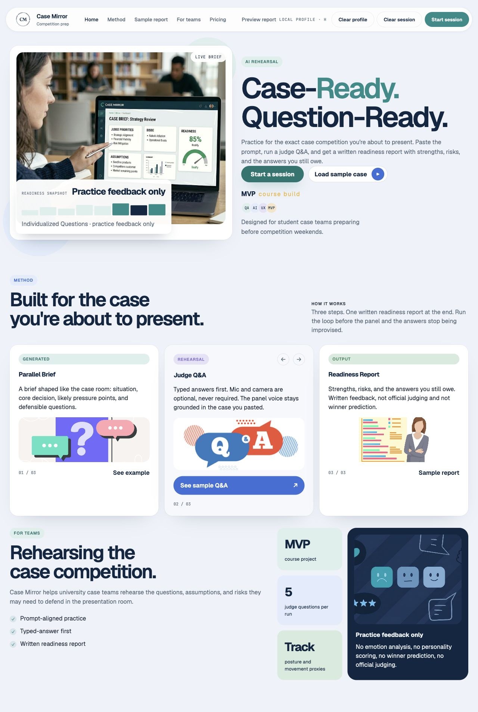
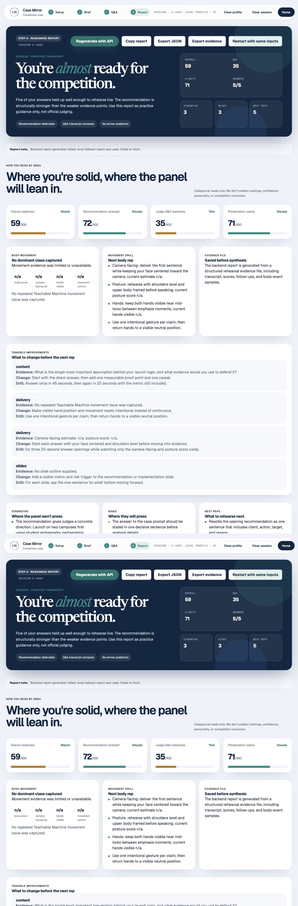

# Case Mirror / CaseCoach

Case Mirror is an ENTI 633 final group project that helps student case-competition teams rehearse under judge-style pressure, improve weak answers, and leave practice with a concrete readiness report.

## Course And Team

- Course: ENTI 633 L01, Generative AI and Prompting
- Program context: Master of Management, Haskayne School of Business, University of Calgary
- Project type: Final Group Project, AI-Assisted Software Development
- Team members:
  - Arash Ajdari - technical development
  - Shayan Shaikh - technical development
  - Haris Naveed - technical development
  - Bilal Ahmed - technical development
  - Alex Titov - presentation and blog coordination
  - Jana van de Vrie - presentation and blog coordination
  - Zarna Shah - presentation and blog coordination
- Team-size note: This seven-member group reflects the merged ENTI 633 / ENTI 333 project team shown in the final presentation deck. If instructor approval or program assignment needs to be documented, the team should confirm this before final D2L submission.
- Repository: https://github.com/Haris-N34/Enti-Final-Project
- Live frontend: https://enti-final-project.vercel.app/

## One-Sentence Pitch

Case Mirror turns a team's case prompt, rubric, recommendation, speaking notes, and practice answers into a guided rehearsal flow with AI-assisted judge questions, answer feedback, delivery signals, and a final readiness report.

## Quick Evaluation Guide

| Course requirement | Repository evidence |
|---|---|
| Working software app | Deployed frontend, local run instructions, [demo-readiness.md](./docs/demo-readiness.md), [testing.md](./docs/testing.md) |
| Clear business problem | Problem and Market Opportunity section, [market-research.md](./docs/market-research.md) |
| Market research and validation | [market-research.md](./docs/market-research.md), [customer-discovery-notes.md](./docs/customer-discovery-notes.md) |
| Requirements engineering | [requirements.md](./docs/requirements.md), [user-stories.md](./docs/user-stories.md) |
| Specialized AI-assisted development | [ai-development-process.md](./docs/ai-development-process.md), [prompt-examples.md](./docs/prompt-examples.md) |
| GitHub documentation | README, LICENSE, [evidence-index.md](./docs/evidence-index.md), architecture/API/testing/security docs |
| Technical components | Static frontend, FastAPI backend, Teachable Machine assets, local fallback flow |
| Team contribution evidence | [team-contributions.md](./docs/team-contributions.md) |

## Problem And Market Opportunity

Student case teams often practice too late, too generally, or without feedback that resembles the pressure of judge Q&A. Teams may know their recommendation but still struggle to defend assumptions, connect evidence to the rubric, manage time, and answer follow-up questions clearly.

Current alternatives include peer practice, coach feedback, generic presentation tools, and manual AI chat prompts. Those options can help, but they usually lack a structured end-to-end workflow for case-specific setup, rubric-aware Q&A, repeated answer practice, and a final improvement report.

Case Mirror focuses on a specific wedge: case competition rehearsal for student teams. The product is not a generic chatbot. It is designed around the case workflow:

1. Understand the case and rubric.
2. Stress-test the recommendation.
3. Practice judge-style questions.
4. Capture answer and delivery evidence.
5. Produce a concrete readiness report.

See [docs/market-research.md](./docs/market-research.md), [docs/competitive-analysis.md](./docs/competitive-analysis.md), and [docs/requirements.md](./docs/requirements.md) for the business reasoning and requirements package.

## Target Users

- Primary user: student teams preparing for case competitions or case-based course presentations.
- Secondary user: coaches, teaching assistants, and instructors who want teams to practice before live feedback sessions.
- Buyer or sponsor context: business schools, entrepreneurship courses, consulting clubs, and student competition programs.

## What The Product Does

The current live rehearsal flow supports:

- Case setup: users enter the case prompt, judging criteria, recommendation, company/context, constraints, and slide outline.
- Case brief: the app generates a structured brief, risks, priorities, and recommendation critique.
- Judge Q&A: users practice judge-style questions with typed-answer reliability and optional microphone support.
- Adaptive follow-ups: weak or incomplete answers receive follow-up questions.
- Readiness report: the app summarizes strengths, weak spots, missed criteria, suggested drills, and next practice steps.
- Browser-side Teachable Machine support: an image model classifies visible upper-body/gesture patterns and feeds evidence such as open palms, neutral hands, pointing, arms crossed, hands too low, excessive movement, and one-hand emphasis into the final report.
- Backend upload analysis: the FastAPI backend includes endpoints for recorded presentation analysis, transcript/slide processing, report artifacts, and observable delivery metrics.

## Screenshots

Current app screenshots are stored under `docs/images/`.

- [Landing page](./docs/images/landing-page.png)
- [Setup form](./docs/images/setup-form.png)
- [Generated brief](./docs/images/brief-page.png)
- [Q&A rehearsal](./docs/images/qa-rehearsal.png)
- [Final readiness report](./docs/images/final-report.png)
- [Backend health check](./docs/images/backend-health.png)

<table>
  <tr>
    <td></td>
    <td></td>
  </tr>
</table>

See [docs/screenshots.md](./docs/screenshots.md) for the required screenshot checklist.

## Repository Structure

```text
.
|- case-mirror/
|  |- index.html
|  |- app.js
|  |- styles.css
|  |- assets/images/
|  `- assets/teachable-image/
|
|- casecoach/
|  `- backend/
|     |- app/
|     |  |- api/
|     |  |- extractors/
|     |  |- models/
|     |  |- pipelines/
|     |  |- prompts/
|     |  |- scoring/
|     |  `- storage/
|     |- tests/
|     |- .env.example
|     |- API_KEYS.md
|     |- README.md
|     |- RUN_LIVE.md
|     `- pyproject.toml
|
|- docs/
|- index.html
|- serve_case_mirror.py
|- vercel.json
|- LICENSE
|- SECURITY.md
|- CONTRIBUTING.md
`- README.md
```

## Technology Choice Note

The course recommends React for web applications, but other web stacks are acceptable. For this short block-week MVP, the team used a static HTML/CSS/JavaScript frontend to maximize demo reliability, reduce deployment risk, and keep the full setup -> brief -> Q&A -> report workflow easy to run from a fresh clone. The backend uses FastAPI for API-based AI/model integrations, upload analysis, live practice endpoints, and testable safety boundaries.

## Technical Overview

### Frontend

The frontend is a static app in `case-mirror/` built with plain HTML, CSS, and JavaScript. It uses hash-based routing, `localStorage` session persistence, progressive enhancement for microphone/webcam access, and browser-loaded Teachable Machine assets.

Main screens:

- `Home`: product positioning and visual overview
- `Setup`: case prompt, rubric, recommendation, and optional context
- `Brief`: generated case brief and recommendation critique
- `Q&A`: judge-style rehearsal with typed fallback, microphone, and optional webcam preview
- `Report`: readiness report with answer, rubric, and delivery evidence

### Backend

The backend is a FastAPI app in `casecoach/backend/`. It supports:

- uploaded presentation analysis
- live preparation
- live answer grading
- final live report synthesis
- transcript, slide, body-metric, timeline, and JSON export artifacts

Technical docs:

- [docs/evidence-index.md](./docs/evidence-index.md)
- [docs/ARCHITECTURE.md](./docs/ARCHITECTURE.md)
- [docs/FRONTEND_GUIDE.md](./docs/FRONTEND_GUIDE.md)
- [docs/API_OVERVIEW.md](./docs/API_OVERVIEW.md)
- [docs/development-log.md](./docs/development-log.md)
- [docs/demo-readiness.md](./docs/demo-readiness.md)
- [docs/team-contributions.md](./docs/team-contributions.md)

## AI-Assisted Development Workflow

This project was developed as an AI-assisted software development project. The repository documents both the AI features inside the product and the AI-assisted coding process used to build it.

Development assistance included:

- ideating the problem and product scope
- drafting requirements and user stories
- generating and revising frontend interaction flows
- building FastAPI endpoint structure and safety boundaries
- creating test cases for backend scoring and safety behavior
- improving documentation and grading readiness
- auditing the repo against the ENTI 633 final project requirements

The final presentation deck documents Codex-supported development, and the repository includes prompt examples, AI-development process notes, QA evidence, and branch-level documentation work. Prompt screenshots should be included in the public blog/article if available, but the repository does not claim screenshot files exist unless they are added under `docs/images/`.

See:

- [docs/ai-development-process.md](./docs/ai-development-process.md)
- [docs/prompt-examples.md](./docs/prompt-examples.md)

## Requirements And Scope

The MVP prioritizes a stable live demo path over a full production platform. The must-have workflow is:

1. Enter case materials.
2. Generate a case brief and critique.
3. Practice judge-style questions.
4. Record typed answers reliably.
5. Optionally capture browser-side delivery evidence.
6. Generate a final readiness report.

See [docs/requirements.md](./docs/requirements.md) and [docs/user-stories.md](./docs/user-stories.md).

## MVP Status

Case Mirror is a course MVP, not a production SaaS product. The current version prioritizes:

- reliable demo flow
- typed-answer fallback
- local/backend fallback behavior
- clear business use case
- evidence-based readiness report
- safe handling of body/delivery signals

Production features such as paid accounts, cloud persistence, enterprise admin dashboards, official judging workflows, and production authentication are intentionally out of scope.

## Local Development

### Prerequisites

- Python 3.12 for the backend
- Python 3.x for the static frontend server
- `ffmpeg` and `ffprobe` for full media-analysis support
- Optional model/API keys for Qwen, Groq, Tavily, and Deepgram

### Frontend

From the repository root:

```bash
python3 serve_case_mirror.py
```

Open:

```text
http://localhost:4173/
```

The root page redirects to `case-mirror/`.

### Backend

From `casecoach/backend/`:

```bash
python3.12 -m venv .venv
.venv/bin/python -m pip install -e ".[test,slides,asr,body]"
.venv/bin/python -m uvicorn app.main:app --host 127.0.0.1 --port 8000
```

Health check:

```bash
curl http://localhost:8000/health
```

Expected response:

```json
{"ok":true}
```

### Environment

See:

- [casecoach/backend/.env.example](./casecoach/backend/.env.example)
- [casecoach/backend/API_KEYS.md](./casecoach/backend/API_KEYS.md)

Optional integrations:

- Qwen-compatible reasoning endpoint for prep, answer grading, and report synthesis
- Groq-compatible endpoint for secondary report fallback
- Tavily for market-context research
- Deepgram for live transcription fallback
- MediaPipe/OpenCV for observable body metrics in the upload pipeline

Browser-side live rehearsal also depends on:

- Teachable Machine image model assets in `case-mirror/assets/teachable-image/`
- `@teachablemachine/image` loaded in `case-mirror/index.html`

## Testing And QA

Backend automated tests:

```bash
cd casecoach/backend
.venv/bin/python -m pytest -q
```

Last local audit result:

```text
18 passed
```

Manual QA is documented in [docs/testing.md](./docs/testing.md). The final submission should include the exact browser/device/date used for the last demo rehearsal.

## Deployment

- `vercel.json` points the deployable output directory at `case-mirror/`.
- The frontend is static and can be hosted independently.
- Camera and microphone features require `localhost` or HTTPS.
- Backend deployment must keep API keys server-side only.

Deployment status:

- Live frontend URL: https://enti-final-project.vercel.app/
- Live frontend status: verified with `HTTP/2 200` on May 15, 2026.
- Live backend URL: not deployed for this MVP; run the FastAPI backend locally for full live API support.
- Deployment note: Vercel serves `case-mirror/` as the site root, so the correct deployed app URL is `/`, not `/case-mirror/`.

## Safety, Privacy, And Scope

Case Mirror is a practice and coaching tool, not an official judging engine.

The system is designed to avoid:

- winner prediction
- official judge simulation claims
- protected-trait inference
- emotion or personality analysis
- unsupported body-language conclusions

Observable delivery/body signals are framed as coaching proxies only. The browser-side demo profile is local-only and does not provide production authentication. API keys belong only in local `.env` files or deployment environment variables, never in the repository.

See [docs/limitations-and-future-work.md](./docs/limitations-and-future-work.md).

## Blog, Video, And Presentation

Final D2L submission requires:

- GitHub repository link: https://github.com/Haris-N34/Enti-Final-Project
- Published blog/article link: pending final submission artifact
- Direct video walkthrough link: pending final submission artifact
- Presentation slides link or attachment: pending final submission artifact

Planning docs:

- [docs/blog-outline.md](./docs/blog-outline.md)
- [docs/demo-script.md](./docs/demo-script.md)
- [docs/presentation-outline.md](./docs/presentation-outline.md)
- [docs/submission-links.md](./docs/submission-links.md)

## License

This project is licensed under the MIT License. See [LICENSE](./LICENSE).
