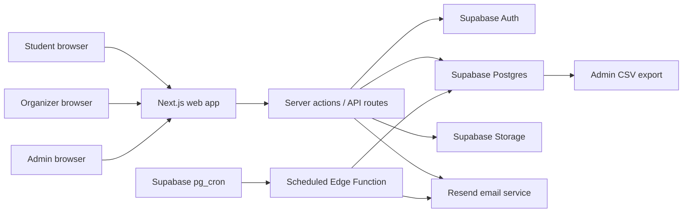

# PRD: SecondServe Campus

## 1. Product overview

### 1.1 Document title and version

- PRD: SecondServe Campus
- Version: 1.0
- Status: Draft for ENTI 333/633 Lab 2
- Last updated: May 12, 2026
- Intended build context: AI coding agent project suitable for a class-length MVP

### 1.2 Product summary

SecondServe Campus is a web application that helps campus event organizers share safe, leftover catered food with students before it goes to waste. Organizers can post a limited-time "food drop" with pickup details, available portions, dietary tags, allergens, and a handling note. Students can browse nearby drops, reserve a portion, and show a pickup code when they arrive.

The product focuses on a narrow but real campus problem: catered student events, faculty meetings, club nights, and orientation sessions often end with trays of edible food that cannot be redistributed efficiently. At the same time, students face rising food costs and inconsistent access to convenient meals between classes. The app creates a lightweight coordination layer between surplus food and students who can use it.

The MVP is intentionally scoped as a campus-only marketplace with no payments, delivery, refrigeration logistics, or AI prediction. It should be buildable by the end of the class while still demonstrating meaningful product thinking, data modeling, user roles, privacy, accessibility, and scalable architecture.

## 2. Problem and opportunity

### 2.1 Problem statement

Campus groups regularly over-order catered food because attendance is uncertain and running out of food at an event is embarrassing. After events end, organizers often do not have a trusted channel to tell students that food is available, track how many portions remain, or avoid overcrowding at pickup. This creates preventable waste and missed value.

Students also lack a reliable way to discover short-window food availability on campus. Informal group chats are fragmented, difficult to verify, and often notify students too late. Students with dietary restrictions have an even harder time deciding whether it is worth walking across campus for unconfirmed leftovers.

### 2.2 Why now

- Food costs and student affordability pressures make campus meal access more valuable.
- Student clubs and departments already use digital tools for events, so adding a lightweight surplus workflow is realistic.
- Modern serverless web stacks make it practical for a small team to build a secure MVP with authentication, database-backed reservations, and notifications.
- Campuses increasingly care about sustainability metrics, and recovered portions can become visible impact data.

### 2.3 Business case

- Primary value for campuses: reduce edible food waste, support student affordability, and produce measurable sustainability data for student affairs, residence life, and club funding reports.
- Primary value for students: discover safe, free, timely food options with dietary and location context.
- Primary value for organizers: avoid awkward waste, manage pickup demand, and close events with a simple impact record.
- Plausible adoption model: pilot with student union clubs and department administrators, then expand through a campus sustainability office or student affairs sponsorship.
- Possible future monetization outside the MVP: annual campus license, premium analytics for institutions, or integration fees for campus event-management systems.

### 2.4 Competitive landscape and differentiation

- Adjacent products such as Too Good To Go, Olio, Karma, and FoodCloud prove that surplus food redistribution is a real category, but they focus mainly on consumer marketplaces, community sharing, restaurants, charities, or commercial food recovery.
- SecondServe Campus is distinct because it is campus-only, free to students, organizer-driven, and built around short pickup windows after internal campus events.
- The MVP does not require merchant payments, public marketplace trust, delivery logistics, or charity warehouse coordination, which keeps the architecture and operations realistic for a class project.
- The defensible wedge is campus trust: verified campus emails, approved organizers, predefined pickup locations, allergen visibility, pickup codes, and administrator impact reporting.

## 3. Goals

### 3.1 Business goals

- Launch a working MVP that can support one campus pilot with 20 organizers and 500 student users.
- Recover at least 500 portions of food during an 8-week pilot.
- Provide simple impact reporting for campus stakeholders: portions claimed, estimated waste avoided, active organizers, and average claim time.
- Build trust through clear role permissions, pickup windows, allergen visibility, and abuse controls.

### 3.2 User goals

- Students can quickly find available food that matches their dietary needs, location, and schedule.
- Students can reserve a portion without racing against vague chat messages.
- Organizers can post surplus food in under 90 seconds from a phone.
- Organizers can control quantity, pickup window, cancellation, and verification.
- Admins can monitor activity, resolve misuse, and export basic impact metrics.

### 3.3 Non-goals

- The MVP will not support paid orders, commercial restaurant listings, delivery, or courier dispatch.
- The MVP will not guarantee nutrition, food safety certification, or allergen absence beyond organizer-provided labels.
- The MVP will not include AI-generated demand forecasting, image recognition, or route optimization.
- The MVP will not support multiple institutions in one shared public marketplace.
- The MVP will not replace campus food banks or emergency support services.
- The MVP will be English-only; the schema should avoid hard-coded display text where practical so future localization remains possible.

## 4. Target users and personas

### 4.1 Key user types

- Students seeking timely free food on campus
- Event organizers with surplus catered food
- Campus administrators monitoring safety, usage, and impact

### 4.2 Persona details

- **Maya, commuter student**: A third-year student who spends long days on campus and wants affordable food between classes. She cares about pickup distance, vegetarian options, and whether food is still available before she walks over.
- **Leo, club executive**: A student club VP who organizes speaker nights and often has pizza, wraps, or snacks left over. He wants to share food responsibly without managing dozens of direct messages.
- **Samira, student affairs coordinator**: A staff member who approves organizers, reviews flagged posts, and wants monthly impact numbers for sustainability and student support reporting. Samira maps to the Admin role in the MVP.

### 4.3 Role-based access

- **Guest**: Can view a public landing page and request a campus account. Cannot view active food drops.
- **Student**: Can browse drops, filter by tags, reserve portions, cancel reservations, view pickup codes, and report a problem.
- **Organizer**: Can do everything a student can do, plus create, edit, pause, close, and verify pickup for food drops they own.
- **Admin**: Can approve organizer access, moderate posts, view all drop and reservation data, deactivate accounts, and export impact reports.

## 5. Scope

### 5.1 In scope for MVP

- Campus email authentication and role-based access.
- Organizer food drop creation with portion count, pickup window, location, dietary tags, allergens, and handling notes.
- Student browse, filter, reserve, cancel, and pickup-code flow.
- Reservation limits to prevent one user from claiming all portions.
- Organizer pickup verification by short code or manual status update.
- Admin dashboard for organizer approvals, flagged posts, and impact metrics.
- Basic email notifications for reservation confirmations, cancellations, and closing reminders.
- Responsive web interface optimized for mobile use.

### 5.2 Out of scope for MVP

- Native iOS or Android apps.
- Real-time GPS tracking or delivery routing.
- Payment processing.
- SMS notifications.
- Full inventory management for pantry shelves or refrigerators.
- Machine-learning demand prediction.
- Multi-campus tenant management.
- Integration with official campus identity providers unless provided by the institution during a pilot.

## 6. Functional requirements

### 6.1 Account and role management

- FR-001: Users must be able to create an account with a campus email address. Priority: Must have.
- FR-002: Users must verify their email before accessing active food drops. Priority: Must have.
- FR-003: Admins must be able to approve or revoke organizer status. Priority: Must have.
- FR-004: The system must enforce Student, Organizer, and Admin permissions server-side. Priority: Must have.

### 6.2 Food drop creation and management

- FR-005: Organizers must be able to create a food drop with title, description, category, portion count, pickup location, pickup start and end time, dietary tags, allergen tags, and safe handling notes. Priority: Must have.
- FR-006: Organizers must be able to upload or attach one optional image for a food drop. Priority: Should have.
- FR-007: Organizers must be able to edit a drop before reservations exist; after reservations exist, safety-sensitive fields such as allergen tags, dietary tags, pickup location, and handling notes require cancelling the drop or admin approval. Priority: Must have.
- FR-008: Organizers must be able to pause, close, or cancel a drop. Priority: Must have.
- FR-009: The system must prevent pickup windows longer than 4 hours unless an admin overrides it. Priority: Must have.
- FR-010: The system must automatically close expired drops. Priority: Must have.

### 6.3 Student discovery and reservations

- FR-011: Students must be able to browse active drops sorted by pickup end time and distance grouping. Priority: Must have.
- FR-012: Students must be able to filter by dietary tags, allergens, category, location, and pickup time. Priority: Must have.
- FR-013: Students must be able to reserve 1 portion by default and up to 2 portions when the organizer allows it. Priority: Must have.
- FR-014: The system must decrement available portions only when a reservation is confirmed. Priority: Must have.
- FR-015: Students must receive a pickup code after reserving. Priority: Must have.
- FR-016: Students must be able to cancel a reservation before pickup. Priority: Must have.
- FR-017: The system must prevent duplicate active reservations for the same drop by the same student. Priority: Must have.

### 6.4 Pickup verification

- FR-018: Organizers must be able to verify pickup by entering a student's short pickup code. Priority: Must have.
- FR-019: Organizers must be able to mark a no-show after the pickup window starts. Priority: Should have.
- FR-020: The system must return no-show portions to the available count only while the pickup window is still active. Priority: Should have.

### 6.5 Notifications

- FR-021: Students must receive an email confirmation after reserving. Priority: Should have.
- FR-022: Organizers must receive a reminder 30 minutes before a drop's pickup window ends if unclaimed portions remain. Priority: Should have.
- FR-023: Students with saved preferences should be able to opt in to email alerts for matching drops. Priority: Nice to have.

### 6.6 Admin and reporting

- FR-024: Admins must see active drops, expired drops, flagged drops, total reservations, claimed portions, and no-show rates. Priority: Must have.
- FR-025: Admins must be able to export a CSV impact report by date range. Priority: Should have.
- FR-026: Admins must be able to flag or remove posts that violate campus rules. Priority: Must have.
- FR-027: Admins must see an audit trail for role changes and removed posts. Priority: Should have.

## 7. Non-functional requirements

### 7.1 Performance

- NFR-001: Active drop list should load in under 2 seconds on a typical campus mobile connection at the 95th percentile.
- NFR-002: Reservation creation must complete in under 1.5 seconds at the 95th percentile when the database is available.
- NFR-003: Database queries for active drops must be indexed by status, pickup_end_at, campus_id, and location_id.
- NFR-004: The MVP should support at least 1,000 active users, 100 organizers, and 100 drops per day for one campus without architecture changes.

### 7.2 Security and privacy

- NFR-005: All protected actions must require authenticated requests.
- NFR-006: Role checks must happen on the server and in database row-level policies.
- NFR-007: Students must not see other students' reservation lists or pickup codes.
- NFR-008: Admin exports must exclude unnecessary personal data by default.
- NFR-009: Pickup codes must be 6-character uppercase alphanumeric codes generated with a cryptographically secure random method, stored only as hashes, scoped to one reservation, and valid until `pickup_end_at` or a terminal reservation status.
- NFR-010: The app must store only the personal data needed for campus account, notification, and reservation workflows.

### 7.2.1 Privacy compliance and retention

- The MVP should be designed for Canadian privacy expectations, including PIPEDA and Alberta PIPA where applicable to a Calgary-based pilot or Alberta institution.
- The app must provide a plain-language privacy notice explaining what account, reservation, notification, and audit data is collected and why.
- Personal data should be retained only while needed for account access, moderation, reporting, and pilot evaluation.
- Reservation records, notification logs, flags, and audit events should be retained for 12 months, then anonymized or deleted unless the institution requires a different documented retention period.
- Impact reports should use aggregate counts by default and avoid exporting student names, pickup codes, or unnecessary emails.

### 7.3 Reliability

- NFR-011: Reservation creation must use a database transaction or equivalent atomic operation to prevent overbooking.
- NFR-012: Expired drop closure must be handled by Supabase `pg_cron` invoking a scheduled Edge Function at least every 5 minutes.
- NFR-013: If email delivery fails, the reservation should still exist and the pickup code should remain visible in-app.

### 7.4 Accessibility

- NFR-014: The interface must meet WCAG 2.2 AA contrast targets.
- NFR-015: Core flows must be usable with keyboard navigation.
- NFR-016: Form fields must have visible labels and clear error messages.
- NFR-017: Dietary and allergen tags must not rely on color alone.
- NFR-018: Mobile touch targets should be at least 44 by 44 CSS pixels.

### 7.5 Maintainability

- NFR-019: Business rules for reservations, role permissions, and drop expiration should live in shared server-side service modules.
- NFR-020: Requirements must be traceable to user stories and acceptance criteria.
- NFR-021: The codebase should include seed data for local development and demo review.

### 7.6 Requirements traceability matrix

| Requirement area | Requirement IDs | Primary user stories |
| --- | --- | --- |
| Account and role management | FR-001, FR-002, FR-003, FR-004 | US-001, US-009, US-015 |
| Food drop creation and management | FR-005, FR-006, FR-007, FR-008, FR-009, FR-010 | US-010, US-011, US-012, US-019 |
| Student discovery and reservations | FR-011, FR-012, FR-013, FR-014, FR-015, FR-016, FR-017 | US-002, US-003, US-004, US-005, US-006, US-007, US-008, US-020 |
| Pickup verification | FR-018, FR-019, FR-020 | US-013, US-014 |
| Notifications | FR-021, FR-022, FR-023 | US-018, US-012 |
| Admin and reporting | FR-024, FR-025, FR-026, FR-027 | US-015, US-016, US-017 |

## 8. Technical architecture and stack

### 8.1 Recommended stack

- **Frontend and backend**: Next.js with TypeScript. Rationale: supports responsive UI, server actions or API routes, and deployable full-stack development in one codebase.
- **Database**: Supabase Postgres. Rationale: relational data suits reservations, roles, audit events, and reporting; Postgres transactions reduce overbooking risk.
- **Authentication**: Supabase Auth with email verification and campus-domain restriction. Rationale: reduces custom auth risk while supporting role-based policies.
- **Styling**: Tailwind CSS with a small component library such as shadcn/ui. Rationale: fast to build, accessible components, consistent design tokens.
- **Email**: Resend or Supabase email templates for transactional emails. Rationale: simple confirmation and reminder delivery without SMS complexity.
- **Scheduled jobs**: Supabase Scheduled Edge Functions using `pg_cron` and `pg_net`. Rationale: fits the Supabase database layer, supports frequent schedules, and avoids relying on Vercel plan-specific cron limits.
- **Deployment**: Vercel for the Next.js app plus Supabase hosted database. Rationale: common, scalable, student-friendly deployment path.
- **File storage**: Supabase Storage for optional drop images. Rationale: avoids a separate asset hosting service.

### 8.2 Architecture overview

The client renders a responsive web app with protected routes for students, organizers, and admins. The Next.js server layer handles form submissions, validates request data, applies role checks, and calls database service functions. Supabase stores user profiles, roles, locations, food drops, reservations, notifications, and audit events. Supabase scheduled Edge Functions close expired drops and send organizer reminders. Email services send confirmations and alerts but are not required for the core reservation record to exist.

### 8.3 Scalability approach

- Keep the MVP single-campus but include a `campus_id` field in core tables so the schema can support a future multi-campus version.
- Use Postgres transactions or stored procedures for reservation creation to prevent race conditions.
- Index active drop queries by status and pickup time because those will be the most common reads.
- Avoid real-time websockets in the MVP; refresh available portions after reservation actions and on page reload.
- Use server-side pagination for admin logs and historical reports.
- Store derived impact metrics through queries first; materialize them later only if reporting becomes slow.

### 8.4 Feasibility constraints

- The MVP does not attempt to verify food safety automatically. It relies on organizer attestations, pickup-window limits, campus policy language, and admin moderation.
- The MVP does not integrate with university single sign-on unless the pilot sponsor provides credentials and approval.
- The MVP should not require a custom mobile app, camera scanning, or push notifications to prove the core concept.

## 9. Data model

### 9.1 Core entities

| Entity | Key fields | Notes |
| --- | --- | --- |
| campuses | id, name, email_domain, timezone, created_at | One campus for MVP; included for future scaling. |
| profiles | id, auth_user_id, campus_id, full_name, email, role, dietary_preferences, allergen_avoidance, notification_opt_in, created_at, updated_at | Extends auth account with app-specific profile and role. |
| organizer_requests | id, profile_id, organization_name, reason, status, reviewed_by, reviewed_at, created_at | Tracks approval workflow for organizer access. |
| campus_locations | id, campus_id, building_name, room_label, pickup_instructions, lat, lng, is_active | Predefined pickup locations reduce ambiguous posts. |
| food_drops | id, campus_id, organizer_id, location_id, title, description, category, portion_total, portion_limit_per_user, pickup_start_at, pickup_end_at, dietary_tags, allergen_tags, handling_note, image_url, status, created_at, updated_at | Main listing object. |
| reservations | id, food_drop_id, student_id, quantity, pickup_code_hash, status, reserved_at, expires_at, picked_up_at, cancelled_at | Status values: reserved, picked_up, cancelled, no_show. |
| notifications | id, recipient_id, food_drop_id, reservation_id, channel, template, status, error_message, sent_at, created_at | Tracks transactional messages. |
| reports_exports | id, admin_id, campus_id, date_from, date_to, file_url, created_at | Optional for CSV export history. |
| audit_events | id, actor_id, entity_type, entity_id, action, metadata_json, created_at | Used for moderation and role changes. |
| flags | id, reporter_id, food_drop_id, reason, status, reviewed_by, created_at, resolved_at | Lets users report unsafe or inaccurate posts. |

### 9.2 Canonical food tags

- MVP dietary tags: vegetarian, vegan, halal, kosher, gluten-free listed, dairy-free listed, nut-free listed.
- MVP allergen tags: contains dairy, contains gluten, contains peanuts/tree nuts, contains soy, contains egg, contains sesame, contains shellfish/fish, allergens unknown.
- Tags should be stored as normalized enum-like strings and displayed as human-readable labels in the interface.
- Organizers must choose at least one allergen tag or explicitly select "allergens unknown."

### 9.3 Important relationships

- One campus has many profiles, locations, and food drops.
- One organizer profile creates many food drops.
- One food drop has many reservations and flags.
- One student profile can have many reservations, but only one active reservation per food drop.
- One admin profile can review many organizer requests, flags, and audit events.

### 9.4 Reservation state rules

- A reservation can move from `reserved` to `picked_up`, `cancelled`, or `no_show`.
- A reservation cannot be picked up after its food drop is closed unless an admin overrides it.
- A cancelled reservation returns its quantity to available portions while the drop is active.
- A no-show can be marked after `pickup_start_at`; its quantity can return to available portions only before `pickup_end_at`.
- Available portions should be calculated as `portion_total - active_reserved_quantity - picked_up_quantity`, with care to avoid double-counting cancelled and no-show records.

## 10. Key user flows

### 10.1 Student first-time flow

1. Student opens the app and selects "Create campus account."
2. Student enters campus email, full name, dietary preferences, and optional allergen avoidance tags.
3. Student verifies email.
4. Student lands on the active drops page with filters prefilled from preferences.
5. Student opens a drop, reviews pickup time, location, allergens, and handling note.
6. Student reserves a portion and receives a pickup code.

### 10.2 Student pickup flow

1. Student opens "My reservations."
2. Student shows the pickup code to the organizer.
3. Organizer enters the code.
4. The reservation changes to `picked_up`.
5. Student sees the reservation in history.

### 10.3 Organizer surplus posting flow

1. Organizer opens "Create food drop."
2. Organizer enters food details, portion count, pickup window, and location.
3. Organizer confirms a safe handling attestation.
4. Food drop becomes visible to verified students.
5. Organizer monitors reservations and remaining portions.
6. Organizer verifies pickup codes and closes the drop when finished.

### 10.4 Admin moderation flow

1. Admin reviews pending organizer requests.
2. Admin approves organizers who are associated with campus clubs, departments, or approved event teams.
3. Admin monitors flagged drops and audit events.
4. Admin removes a post or revokes organizer access when necessary.
5. Admin exports a monthly impact report.

## 11. User experience requirements

### 11.1 Interface principles

- The app should feel trustworthy, quick, and operational rather than like a social feed.
- The most important information on a drop card must be visible without opening details: title, pickup window, location, portions left, dietary tags, and allergen tags.
- Reservation status should be obvious and persistent until pickup is complete.
- Organizer forms should use predefined locations and tags where possible to reduce typing mistakes.
- Admin views should prioritize scanability, status filters, and concise tables.

### 11.2 Screen inventory

- Public landing and login page.
- Student active drops page.
- Drop detail page.
- My reservations page.
- Student preferences page.
- Organizer dashboard.
- Create/edit food drop page.
- Pickup verification page.
- Admin dashboard.
- Organizer request review page.
- Flagged posts page.
- Impact report export page.

### 11.3 Error states and edge cases

- A student tries to reserve the last portion after another student already claimed it.
- A pickup window expires while a student is viewing the drop.
- An organizer cancels a drop after students have reservations.
- Email confirmation fails but the reservation succeeds.
- A student loses their pickup code.
- A drop has allergen information marked "unknown."
- A user with an unverified email attempts to view drops.
- A student attempts to reserve more than the per-user limit.
- An organizer tries to create a pickup window in the past.
- An admin revokes organizer status while the organizer has active drops.

## 12. Brand and design direction

### 12.1 Brand position

SecondServe Campus should feel like a practical campus utility: warm enough to invite students in, but structured enough for administrators to trust. It should avoid looking like a charity app that stigmatizes users. The core message is "good food, claimed quickly, wasted less."

### 12.2 Visual identity

- Brand personality: resourceful, warm, credible, low-friction, campus-minded.
- Primary color: Sprout green `#2F7D57` for trust, action, and food recovery.
- Secondary color: Harvest gold `#F2B84B` for pickup urgency and optimistic highlights.
- Accent color: Tomato coral `#E85D4F` for warnings, flags, and expiring drops.
- Neutral ink: `#25312B` for high-contrast text.
- Surface color: `#F8F6F0` for warm page backgrounds.
- Typography: Inter or system sans for clear operational UI; slightly heavier headings for scanability.
- Component style: compact cards, high-contrast tags, clear status chips, 8px border radius, no decorative clutter.

### 12.3 Supporting brand and prototype references

- Detailed brand kit included in the submission package: `brand-kit.md`
- Central feature prototype included in the submission package: `prototype.html`

## 13. Success metrics

### 13.1 User-centric metrics

- Median time from drop creation to first reservation: under 10 minutes.
- Student reservation completion rate: at least 70 percent of started reservation attempts.
- Pickup completion rate: at least 80 percent of reservations become picked up.
- Student-reported clarity rating for allergen and pickup information: average 4 out of 5 or higher in pilot survey.

### 13.2 Business and impact metrics

- Portions recovered during 8-week pilot: at least 500.
- Active organizer retention: at least 50 percent of approved organizers create more than one drop.
- Estimated food waste avoided: reported monthly using claimed portion count.
- Admin time to produce monthly impact report: under 5 minutes.

### 13.3 Technical metrics

- Active drops page p95 load time under 2 seconds.
- Reservation transaction error rate below 1 percent excluding user-caused validation errors.
- Zero successful unauthorized access events in testing.
- Automated test coverage for reservation state transitions, role permissions, and expired drop handling.

## 14. Risks, assumptions, and mitigations

### 14.1 Key assumptions

- Campus groups are willing to post surplus food if the workflow takes less than 90 seconds.
- Students will trust posts more if they are limited to verified campus accounts and approved organizers.
- A campus pilot can start with email verification instead of full single sign-on.
- Basic email notifications are enough for MVP adoption.

### 14.2 Risks and mitigations

| Risk | Likelihood | Impact | Mitigation |
| --- | --- | --- | --- |
| Food safety concerns make administrators hesitant. | Medium | High | Include safe handling attestation, short pickup windows, admin moderation, disclaimers, and approved organizer roles. |
| Organizers post vague or inaccurate allergen information. | Medium | High | Require allergen field, allow "unknown," show warnings clearly, and allow users to flag posts. |
| Students reserve but do not show up. | Medium | Medium | Track no-shows, allow cancellation, and expose no-show rates in admin reporting. |
| Popular drops are overbooked during high demand. | Medium | High | Use atomic reservation transactions and per-user limits. |
| Scope expands into delivery, restaurants, or food bank inventory. | High | Medium | Keep those areas explicitly out of scope for MVP. |
| Admin dashboard becomes too complex. | Medium | Medium | Limit MVP admin tools to approvals, flags, active monitoring, and CSV impact export. |

## 15. Milestones and sequencing

### 15.1 Project estimate

- Medium: 4 to 6 weeks for a class MVP with one developer using an AI coding agent and periodic manual review.

### 15.2 Suggested phases

- **Phase 1: Project setup and core schema** (3 to 4 days)
  - Next.js app, Tailwind, Supabase project, auth, database migrations, seed data.
- **Phase 2: Student discovery and reservation MVP** (1 to 1.5 weeks)
  - Active drops list, filters, drop detail, reservation creation, pickup code display.
- **Phase 3: Organizer tools** (1 week)
  - Organizer approval check, create/edit drop, dashboard, pickup verification, close/cancel flow.
- **Phase 4: Admin and reporting** (1 week)
  - Organizer request review, flagged posts, impact metrics, CSV export, audit events.
- **Phase 5: Notifications, polish, and testing** (1 to 1.5 weeks)
  - Email confirmations, reminder job, responsive polish, accessibility pass, automated tests, demo data.

### 15.3 Testing plan

- Unit tests for reservation availability calculations and state transitions.
- Integration tests for role permissions and protected routes.
- End-to-end tests for student reservation, organizer verification, and admin approval flows.
- Manual accessibility checks for keyboard navigation, focus states, labels, and contrast.
- Load sanity test for active drop list with at least 1,000 seeded users, 100 organizers, and 500 historical drops.

## 16. User stories

### 16.1 Create a verified student account

- ID: US-001
- Description: As a student, I want to create and verify an account with my campus email so that I can access trustworthy campus-only food drops.
- Acceptance criteria:
  - The signup form requires full name and campus email.
  - Non-campus email domains are rejected with a clear message.
  - The user cannot view active drops until email verification is complete.
  - A profile record is created after successful verification.

### 16.2 Save dietary preferences

- ID: US-002
- Description: As a student, I want to save dietary preferences and allergen avoidance tags so that matching drops are easier to find.
- Acceptance criteria:
  - The student can select multiple dietary tags and allergen avoidance tags.
  - Saved preferences prefill active drop filters.
  - The student can update preferences later.
  - Tags are displayed as text labels, not color-only indicators.

### 16.3 Browse active food drops

- ID: US-003
- Description: As a student, I want to browse currently available food drops so that I can decide whether to reserve one.
- Acceptance criteria:
  - Only drops with `active` status and non-expired pickup windows are shown.
  - Each card shows title, location, pickup window, portions left, dietary tags, and allergen tags.
  - Drops are sorted by pickup end time by default.
  - Empty state explains that no drops currently match the filters.

### 16.4 Filter food drops

- ID: US-004
- Description: As a student, I want to filter drops by dietary tags, allergens, category, location, and pickup time so that I can find relevant options quickly.
- Acceptance criteria:
  - Filters update the visible list without clearing saved preferences.
  - Students can remove all filters in one action.
  - Allergen filters clearly exclude matching allergen tags when selected.
  - Filter state remains visible on mobile.

### 16.5 View drop details

- ID: US-005
- Description: As a student, I want to review the details of a food drop before reserving so that I understand pickup instructions and dietary risks.
- Acceptance criteria:
  - Detail page shows description, pickup instructions, handling note, allergens, dietary tags, portions left, and pickup deadline.
  - If allergen information is unknown, the page shows a prominent warning.
  - Reserve button is disabled when no portions remain or pickup window has expired.
  - The page updates availability after a reservation attempt.

### 16.6 Reserve a portion

- ID: US-006
- Description: As a student, I want to reserve a portion so that food is held for me during the pickup window.
- Acceptance criteria:
  - Student can reserve only within the allowed per-user portion limit.
  - The system prevents duplicate active reservations for the same drop.
  - Reservation creation fails gracefully if portions run out during the attempt.
  - Successful reservation displays a pickup code and appears in "My reservations."

### 16.7 Cancel a reservation

- ID: US-007
- Description: As a student, I want to cancel a reservation I cannot pick up so that another student can claim the food.
- Acceptance criteria:
  - Student can cancel only their own active reservation.
  - Cancelled quantity returns to available portions if the drop is still active.
  - Cancelled reservations no longer show an active pickup code.
  - Organizer dashboard updates the reservation status.

### 16.8 Show pickup code

- ID: US-008
- Description: As a student, I want to show a pickup code at the pickup location so that the organizer can verify my reservation quickly.
- Acceptance criteria:
  - Pickup code is visible from "My reservations."
  - Pickup code is scoped to one active reservation.
  - Pickup code is hidden after pickup, cancellation, or no-show status.
  - If email failed, the in-app code still appears.

### 16.9 Request organizer access

- ID: US-009
- Description: As a campus event organizer, I want to request organizer access so that I can post surplus food after events.
- Acceptance criteria:
  - A verified user can submit organization name and reason.
  - User sees pending status after submitting.
  - Admin can approve or reject the request.
  - Approved users receive Organizer permissions.

### 16.10 Create a food drop

- ID: US-010
- Description: As an organizer, I want to create a food drop quickly so that students can claim surplus food before it is wasted.
- Acceptance criteria:
  - Required fields include title, category, portion count, pickup location, pickup window, allergen tags or unknown, and handling note.
  - Pickup end time cannot be in the past.
  - Pickup window cannot exceed 4 hours without admin override.
  - Organizer must confirm safe handling attestation before publishing.
  - Published drop appears in the student active drops list.

### 16.11 Edit an unpublished or unreserved drop

- ID: US-011
- Description: As an organizer, I want to edit a drop before students reserve it so that I can correct mistakes.
- Acceptance criteria:
  - Organizer can edit their own drop before reservations exist.
  - Organizer cannot change allergen tags after reservations exist without cancelling or admin approval.
  - Edits create an audit event.
  - Students see updated information after refresh.

### 16.12 Cancel or close a food drop

- ID: US-012
- Description: As an organizer, I want to cancel or close a food drop so that students do not travel for unavailable food.
- Acceptance criteria:
  - Organizer can cancel their own active drop.
  - Students with active reservations are notified by email when possible.
  - Cancelled drops are removed from active browse results.
  - Closed drops remain visible to organizer and admin history.

### 16.13 Verify pickup

- ID: US-013
- Description: As an organizer, I want to verify a student's pickup code so that claimed portions are recorded accurately.
- Acceptance criteria:
  - Organizer can enter a valid code for their own active drop.
  - Matching reservation status changes to `picked_up`.
  - Invalid, expired, or already-used codes return clear errors.
  - Picked-up quantity contributes to impact metrics.

### 16.14 Mark no-show

- ID: US-014
- Description: As an organizer, I want to mark no-shows so that reservation history and impact metrics stay accurate.
- Acceptance criteria:
  - Organizer can mark no-show only after pickup start time.
  - No-show status is available only for their own drop reservations.
  - No-show quantity can return to availability only before pickup end time.
  - Student history shows the reservation as missed.

### 16.15 Approve organizer requests

- ID: US-015
- Description: As an admin, I want to approve or reject organizer requests so that only trusted campus groups can post food.
- Acceptance criteria:
  - Admin sees pending requests with requester details and organization name.
  - Admin can approve or reject with an optional note.
  - Role changes are enforced immediately.
  - Role changes create audit events.

### 16.16 Moderate flagged drops

- ID: US-016
- Description: As an admin, I want to review flagged drops so that unsafe or inaccurate listings can be removed quickly.
- Acceptance criteria:
  - Admin dashboard shows unresolved flags.
  - Admin can remove a drop, dismiss the flag, or contact the organizer outside the app.
  - Removed drops are hidden from students.
  - Moderation action creates an audit event.

### 16.17 Export impact report

- ID: US-017
- Description: As an admin, I want to export impact metrics by date range so that I can report the pilot's value to campus stakeholders.
- Acceptance criteria:
  - Admin selects start and end dates.
  - CSV includes drops created, portions posted, portions reserved, portions picked up, no-show rate, active organizers, and active students.
  - Export excludes pickup codes and unnecessary personal information.
  - Export action creates a report history record.

### 16.18 Receive reservation confirmation

- ID: US-018
- Description: As a student, I want to receive a confirmation after reserving so that I remember where and when to pick up food.
- Acceptance criteria:
  - Confirmation includes title, pickup location, pickup window, and instructions.
  - Confirmation does not expose other students' information.
  - Email delivery failure does not cancel the reservation.
  - Notification status is logged.

### 16.19 Auto-close expired drops

- ID: US-019
- Description: As a system admin, I want expired drops to close automatically so that students do not see stale food listings.
- Acceptance criteria:
  - Supabase scheduled Edge Function runs at least every 5 minutes.
  - Drops with pickup_end_at in the past change from `active` to `expired`.
  - Expired drops disappear from student browse results.
  - Job failures are logged for review.

### 16.20 Prevent overbooking

- ID: US-020
- Description: As a student, I want the app to prevent overbooking so that my confirmed reservation is actually valid.
- Acceptance criteria:
  - Concurrent reservation attempts cannot exceed available portions.
  - The final successful reservation receives a pickup code.
  - Later attempts receive a clear "no portions left" message.
  - Automated tests cover concurrent reservation logic.

## Appendix A: Research and methodology

This PRD structure was informed by the lab's referenced Ian Nuttall PRD prompt/template, plus PRD guidance from Atlassian, Aha!, Miro, Dovetail, and Cavaro. These sources commonly emphasize product vision, target users, scope, functional requirements, non-functional requirements, success metrics, milestones, risks, assumptions, and user stories with acceptance criteria. The final structure intentionally includes those elements so the document can function as a clear first prompt for an AI coding agent.
